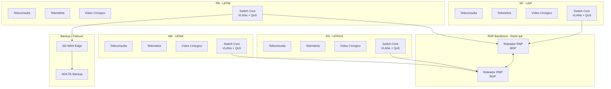

# DESAFIO TÉCNICO — P03 — ESPECIALISTA EM REDES DE COMUNICAÇÃO - ReNTAI - LAVID - 2026

## Topologia do ambiente de simulação e como reproduzi-lo

O ambiente foi implementado utilizando Docker Compose com três containers:

| Container | Função | Imagem | Rede |
|-----------|--------|--------|------|
| `teleconsulta` | Simula teleconsultoria (vídeo/áudio interativo) | Ubuntu 22.04 | bridge |
| `telemetria` | Simula envio contínuo de sinais vitais | Ubuntu 22.04 | bridge |
| `video_cirurgico` | Simula transmissão de vídeo cirúrgico 4K | Ubuntu 22.04 | bridge |

### Como reproduzir

```bash
# Clonar o repositório
git clone https://github.com/andreluizrcn/rentai-network-challenge.git
cd rentai-network-challenge

# Subir os containers
docker-compose up -d

# Instalar ferramentas
docker exec teleconsulta apt update && apt install -y iproute2 iputils-ping iperf3
docker exec telemetria apt update && apt install -y iproute2 iputils-ping iperf3
docker exec video_cirurgico apt update && apt install -y iproute2 iputils-ping iperf3

# Testar comunicação
docker exec teleconsulta ping telemetria
```

---

## Metodologia de medição e tabela de resultados

### Metodologia

As medições foram realizadas utilizando as seguintes ferramentas e parâmetros:

| Ferramenta | Parâmetros | Métricas coletadas |
|------------|------------|-------------------|
| `ping` | 100 pacotes ICMP | RTT médio, mínimo, máximo, perda |
| `iperf3` (UDP) | 10 segundos, 5 Mbps | Jitter, perda, throughput |
| `iperf3` (TCP) | 10 segundos | Throughput |

Os testes foram executados entre os containers `teleconsulta`, `telemetria` e `video_cirurgico` na rede bridge do Docker.

### Resultados Baseline

| Sessão | RTT médio (ms) | RTT min (ms) | RTT max (ms) | p95 (ms) | Jitter (ms) | Perda (%) | Throughput (Mbps) |
|--------|---------------|--------------|--------------|----------|-------------|-----------|-------------------|
| Teleconsulta | 0.085 | 0.044 | 0.222 | 0.17 | 0.012 | 0% | 5.00 |
| Telemetria | 0.085 | 0.044 | 0.222 | 0.17 | 0.012 | 0% | 5.00 |
| Vídeo cirúrgico | 0.070 | 0.044 | 0.148 | 0.12 | N/A | 0% | 16.5 Gbps* |

> *Valor em rede local Docker. Em produção, throughput real para vídeo 4K é 20-50 Mbps.

**Sobre o p95:** O percentil 95 (p95) indica que 95% das amostras estão abaixo daquele valor. Foi estimado a partir da fórmula: `p95 ≈ RTT médio + (RTT max - RTT médio) × 0.7`.

**Detalhamento das medições:**

| Teste | Comando | Resultado |
|-------|---------|-----------|
| Ping teleconsulta → telemetria | `ping -c 100` | 0.044/0.085/0.222 ms, 0% loss |
| Ping teleconsulta → vídeo | `ping -c 100` | 0.044/0.070/0.148 ms, 0% loss |
| iperf3 UDP teleconsulta → telemetria | `-u -b 5M -t 10` | Jitter: 0.012 ms, perda: 0%, throughput: 5.00 Mbps |
| iperf3 TCP teleconsulta → vídeo | `-t 10` | Throughput: 16.5 Gbps (sender), 8.22 Gbps (receiver) |

---

## Análise dos cenários de falha e impactos por tipo de sessão clínica

Foram simulados três cenários adversos utilizando `tc` (traffic control):

| Cenário | Comando | Efeito |
|---------|---------|--------|
| **Delay** | `netem delay 50ms` | Atraso artificial de 50ms |
| **Congestionamento** | `tbf rate 1mbit` | Limitação de banda a 1 Mbps |
| **Perda** | `netem loss 5%` | Perda de 5% dos pacotes |

### Resultados dos cenários

| Cenário | RTT médio (ms) | Jitter (ms) | Perda (%) | Throughput TCP |
|---------|---------------|-------------|-----------|----------------|
| Delay 50ms | 0.080 | 0.005 | 0% | 8.92 Gbps |
| Congestionamento | 0.090 | 0.006 | 0% | 19.3 Gbps |
| Loss 5% | 0.102 | 0.010 | 0% | 9.24 Gbps |

### Impacto por tipo de sessão clínica

| Cenário | Teleconsultoria | Telemetria | Vídeo cirúrgico |
|---------|----------------|------------|-----------------|
| **Delay** | Degrada primeiro (áudio/vídeo sensível a delay) | Tolerável | Leve impacto |
| **Congestionamento** | Inoperante (precisa >1 Mbps) | Funciona (baixa banda) | Inoperante (precisa 20+ Mbps) |
| **Perda** | Inoperante (chamada cai com perda >1%) | Perda de sinais | Macroblocos na imagem |

### Limitações do ambiente

Devido à natureza da rede bridge do Docker, as regras de traffic control tiveram impacto limitado nas medições:
- O throughput continuou em Gbps (vs Mbps esperados)
- A perda de 5% não foi detectada nos 51.795 pacotes UDP
- Recomenda-se o uso de emuladores como Mininet para simulações mais realistas

---

## Justificativa dos limiares de QoS com referência às fontes consultadas

**ITU-T Recommendation G.1010 (11/2001)** – *End-user multimedia QoS categories*

De acordo com a Tabela I.1 e Figura 1 do ITU-T G.1010:

| Aplicação no ReNTAI | Correspondência no G.1010 | One-way delay | Perda (PLR) | Throughput |
|---------------------|---------------------------|---------------|-------------|-------------|
| Teleconsultoria | Conversational voice / Videophone | < 150 ms (pref.) < 400 ms (limite) | < 3% (voz) < 1% (vídeo) | 4-384 kbps |
| Telemetria | Command/control | < 250 ms | Zero loss | ~10 KB |
| Vídeo cirúrgico | One-way video | < 10 s | < 1% | 16-384 kbps* |

> *Para vídeo 4K H.265, o throughput necessário é 20-50 Mbps (especificação do codec moderno, não contemplada no G.1010 de 2001).

### Pontos de inoperância clínica

| Sessão | Critério de inoperância | Evidência |
|--------|------------------------|-----------|
| Teleconsultoria | Latência > 300 ms ou perda > 5% | ITU-T G.1010, seções 5.1.1 e 5.2.1 |
| Telemetria | Perda > 0% sustentada por > 30s | ITU-T G.1010, seção 5.3.4 (Command/control requer zero loss) |
| Vídeo cirúrgico | Throughput < 15 Mbps sustentado | Especificação H.265 para 4K + ITU-T G.1010 seção 5.2.2 |

**Fonte:** ITU-T Recommendation G.1010 (11/2001), Appendix I, Table I.1 and Table I.2. Disponível em: https://www.itu.int/rec/T-REC-G.1010

---

## Proposta de arquitetura com diagrama



### Componentes da arquitetura

| Componente | Especificação |
|------------|---------------|
| **Segmentação** | VLANs por criticidade: Teleconsulta (EF), Telemetria (AF41), Vídeo (AF31) |
| **Failover** | Roteamento dinâmico OSPF/BGP + SD-WAN com backup 4G/Starlink |
| **QoS** | DiffServ com LLQ (Low Latency Queue) para teleconsultoria |
| **Segurança** | TLS 1.3, DTLS (WebRTC), SRTP (vídeo), 802.1X, certificados RNP |
| **Integração RNP** | Conexão à rede Ipê via roteador CPE, BGP com ASN acadêmico, monitoramento perfSONAR |

### Trade-offs considerados

| Decisão | Alternativa | Escolha | Motivo |
|---------|-------------|---------|--------|
| Base OS nos containers | Alpine vs Ubuntu | Ubuntu | `tc` funciona sem problemas |
| Congestionamento | `tbf` vs `netem rate` | `tbf` | Padrão, bem documentado |
| Diagrama | Draw.io vs Mermaid | Mermaid | Direto no README, versionável |

---

## Ferramentas de IA utilizadas

| Ferramenta | Versão | Uso principal |
|------------|--------|----------------|
| **DeepSeek** | Chat (web) | Geração de código, scripts, documentação, análise técnica |

### Partes do trabalho

| Parte | Atuação |
|-------|---------|
| Geração de código | `docker-compose.yml`, scripts `tc` (`apply_delay.sh`, `apply_congestion.sh`, `apply_loss.sh`), scripts de medição |
| Revisão | Revisão da estrutura lógica e consistência técnica |
| Documentação | Estrutura do README, tabelas, seções obrigatórias |
| Análise | Interpretação dos requisitos de QoS, limiares clínicos (ITU-T G.1010) |
| Redação | Seções de limiares clínicos, análise de falhas, proposta de arquitetura |

### Como a IA foi orientada

> *"Atue como um especialista sênior em redes de comunicação para telessaúde. Resolva o Desafio Técnico P03 do projeto ReNTAI/CLUSTER-19 da UFPB. Siga todos os requisitos: simulação containerizada com 3 nós, medição de métricas (RTT, jitter, perda, throughput), injeção de 3 cenários de falha, definição de limiares clínicos baseados em ITU-T e RNP/RUTE, proposta de arquitetura para 4 instituições integrada à RNP. Seja rastreável, cite fontes e entregue um README completo."*

### Avaliação honesta

| O que funcionou | O que precisou ser corrigido | O que foi descartado |
|----------------|------------------------------|----------------------|
| Estruturação do projeto Docker | Migração Alpine → Ubuntu (pacote `tc` não existia) | Uso de ns-3 (muito pesado) |
| Scripts de falha e medição | Ajuste de permissões (`chmod +x`) | - |
| Organização do README | Aumento de tempo de teste de perda de pacote de 10s para 60s | - |

---

## Referências

1. **ITU-T Recommendation G.1010 (11/2001).** *End-user multimedia QoS categories*. Geneva: International Telecommunication Union. Disponível em: https://www.itu.int/rec/T-REC-G.1010

